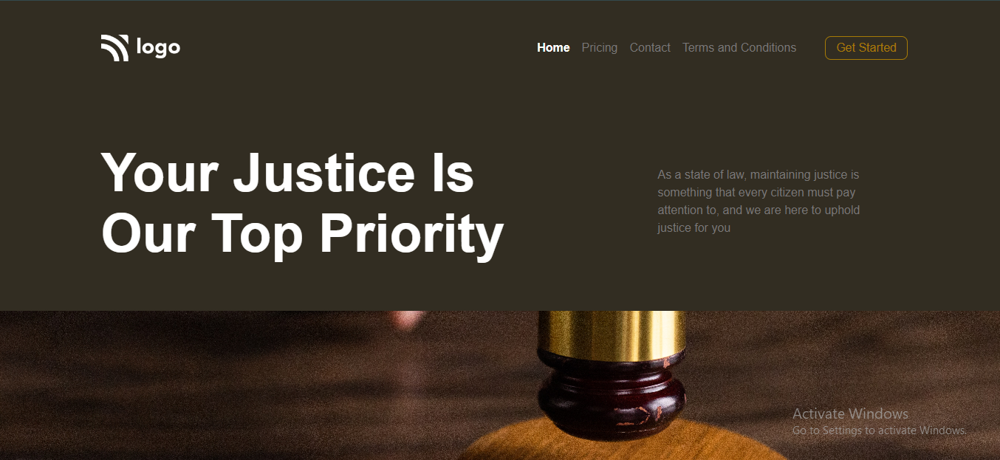

# Assignment 1

# Project 3 

### What I Learned from this Project?

- I learned about positioning around the webpage.
- Learnd to use css position [Relative & Absolute] property.

### This project took around 2 hours to complete.

### Screenshot

